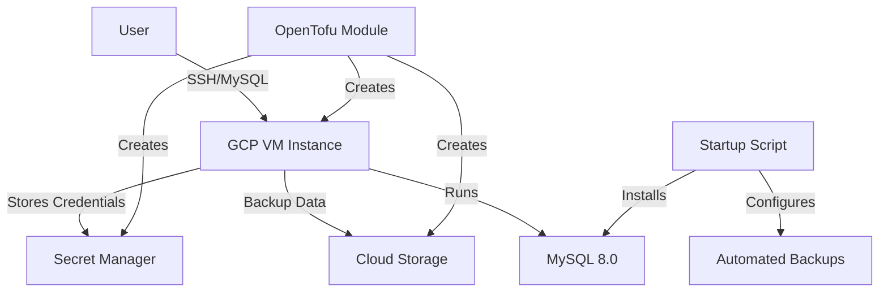

# OpenTofu/Terraform GCP MySQL Self-Managed Infrastructure

A production-ready infrastructure as code solution for deploying self-managed MySQL 8.0 on Google Cloud Platform using OpenTofu/Terraform. This project implements enterprise security best practices and provides automated MySQL installation with integrated Cloud Storage backup solutions.

## 🏗️ Project Structure

```
├── module-stack/          # Reusable OpenTofu module for GCP VM with Cloud Storage
│   ├── main.tf           # Core VM and storage resources
│   ├── variables.tf      # Module input variables
│   ├── outputs.tf        # Module outputs
│   ├── provider.tf       # Provider configuration
│   └── README.md         # Module documentation
├── project-stack/         # Implementation using the module
│   ├── compute.tf        # VM deployment using module
│   ├── secrets.tf        # Secret Manager configuration
│   ├── startup_script.sh # MySQL installation script
│   ├── locals.tf         # Local values and configuration
│   ├── variables.tf      # Project variables
│   ├── terraform.tfvars.example # Example configuration
│   ├── provider.tf       # Provider configuration
│   └── README.md         # Implementation documentation
└── README.md             # This file
```

## 🚀 Quick Start

### Prerequisites

- **OpenTofu/Terraform**: >= 1.9.0
- **Google Cloud SDK**: Latest version
- **GCP Project**: With billing enabled
- **Service Account**: With required permissions (see [Permissions](#-permissions) section)

### 1. Clone and Configure

```bash
git clone <repository-url>
cd opentofu-gcp-mysql-self-managed
```

### 2. Set Up Configuration

```bash
cd project-stack
cp terraform.tfvars.example terraform.tfvars
# Edit terraform.tfvars with your project-specific values
```

### 3. Initialize and Deploy

```bash
# Initialize OpenTofu
tofu init

# Review the execution plan
tofu plan

# Deploy the infrastructure
tofu apply
```

### 4. Access Your MySQL Instance

```bash
# Get VM external IP
VM_IP=$(tofu output -raw gcp_vm_output | jq -r '.external_ip')

# SSH to the VM
gcloud compute ssh <instance-name> --zone=<zone>

# Get MySQL password from Secret Manager
MYSQL_PASSWORD=$(gcloud secrets versions access latest --secret="<secret-name>")

# Connect to MySQL
mysql -u appuser -p$MYSQL_PASSWORD
```

## 🛡️ Security Features

### Infrastructure Security
- **Shielded VM**: vTPM, Secure Boot, and Integrity Monitoring
- **Service Account**: Least-privilege access with specific scopes
- **Deletion Protection**: Prevents accidental resource deletion
- **Network Security**: Configurable firewall rules and IP restrictions

### Database Security
- **Google Secret Manager**: Secure credential storage
- **Random Password Generation**: 16-character complex passwords
- **User Separation**: Dedicated application user with limited privileges
- **Connection Security**: SSL/TLS encryption support

### Storage Security
- **Public Access Prevention**: Enforced on all buckets
- **Uniform Bucket-Level Access**: Simplified IAM management
- **Versioning**: Data protection and recovery capabilities
- **Lifecycle Policies**: Automated cost optimization

## 📊 Architecture Overview



## 🔧 Configuration

### Core Variables

| Variable | Description | Type | Default | Required |
|----------|-------------|------|---------|----------|
| `project_id` | GCP Project ID | `string` | - | ✅ |
| `zone` | GCP Zone | `string` | - | ✅ |
| `environment` | Environment (dev/staging/prod) | `string` | - | ✅ |
| `machine_type` | VM machine type | `string` | `e2-small` | ❌ |
| `boot_disk_size` | Boot disk size (GB) | `number` | `20` | ❌ |
| `service_account_email` | Service account email | `string` | - | ✅ |
| `subnetwork` | VPC subnetwork | `string` | - | ✅ |

### Organization Structure

The project uses a standardized naming convention:
- `ou`: Organizational Unit (e.g., "myorg")
- `bu`: Business Unit (e.g., "engineering")  
- `pu`: Product Unit (e.g., "webapp")

Resources are named: `{ou}-{bu}-{pu}-{environment}`

## 🔐 Permissions

Your service account needs the following IAM roles:

### Required Roles
```bash
# Core compute permissions
gcloud projects add-iam-policy-binding PROJECT_ID \
  --member="serviceAccount:SERVICE_ACCOUNT_EMAIL" \
  --role="roles/compute.instanceAdmin"

# Secret Manager access
gcloud projects add-iam-policy-binding PROJECT_ID \
  --member="serviceAccount:SERVICE_ACCOUNT_EMAIL" \
  --role="roles/secretmanager.admin"

# Storage permissions
gcloud projects add-iam-policy-binding PROJECT_ID \
  --member="serviceAccount:SERVICE_ACCOUNT_EMAIL" \
  --role="roles/storage.admin"

# Service usage permissions
gcloud projects add-iam-policy-binding PROJECT_ID \
  --member="serviceAccount:SERVICE_ACCOUNT_EMAIL" \
  --role="roles/serviceusage.serviceUsageAdmin"
```

## 📋 Features

### ✅ MySQL Database
- **Version**: MySQL 8.0.42 (latest stable)
- **Installation**: Automated via startup script
- **Authentication**: Secure password management
- **Users**: Separated root and application users
- **Logging**: Complete installation and operation logs

### ✅ Backup System
- **Cloud Storage Integration**: Automated backups to GCS
- **Retention Policy**: 30-day retention in cloud, 3 local backups
- **Scheduling**: Daily backups at 2:00 AM UTC via cron
- **Monitoring**: Comprehensive logging and error handling

### ✅ High Availability Options
- **Multiple Zones**: Deploy across different zones
- **Persistent Disks**: Durable storage with snapshots
- **Load Balancing**: Ready for multi-instance deployments

### ✅ Monitoring & Observability
- **Cloud Logging**: Integrated with Google Cloud Logging
- **Metrics**: VM and application metrics
- **Alerting**: Custom alert policies (configurable)

## 🛠️ Advanced Usage

### Custom Machine Types

```hcl
# For high-performance workloads
machine_type = "n2-highmem-8"
boot_disk_size = 100
boot_disk_type = "pd-ssd"
```

### Multi-Environment Deployment

```bash
# Development
tofu workspace new dev
tofu apply -var="environment=dev"

# Production  
tofu workspace new prod
tofu apply -var="environment=prod"
```

### Custom Backup Configuration

The backup system can be customized by modifying the startup script:

```bash
# Custom backup schedule (edit crontab in startup_script.sh)
# Current: Daily at 2:00 AM UTC
# Example: Every 6 hours
0 */6 * * * /opt/mysql-backup/mysql_backup.sh
```

## 🧪 Testing

### Validate Infrastructure

```bash
# Test OpenTofu configuration
tofu validate

# Security scanning (using tfsec)
tfsec .

# Plan validation
tofu plan -detailed-exitcode
```

### Verify MySQL Installation

```bash
# Check MySQL service status
sudo systemctl status mysql

# Verify backup system
sudo crontab -l
ls -la /opt/mysql-backup/

# Test backup script
sudo /opt/mysql-backup/mysql_backup.sh
```

## 📈 Cost Optimization

### Resource Sizing Guidelines

| Environment | Machine Type | Disk Size | Monthly Cost (Approx.) |
|-------------|--------------|-----------|------------------------|
| Development | `e2-micro` | 20 GB | $10-15 |
| Staging | `e2-small` | 30 GB | $20-30 |
| Production | `e2-medium` | 50 GB | $40-60 |

### Cost-Saving Features
- **Preemptible VMs**: Available for non-critical environments
- **Committed Use Discounts**: For long-running workloads
- **Storage Lifecycle**: Automatic transition to cheaper storage classes


## 📄 License

This project is licensed under the MIT License
